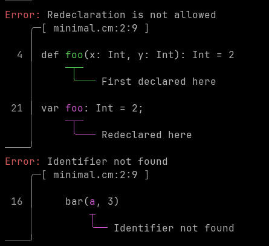

<h1>🐙 Calamars 🌕</h1>


Calamars is an experimental programming language that’s still very much in development, but with some clear goals:


- **Typst-powered doc blocks**. Documentation and scientific writing should feel effortless. You can include Typst right inside your code for beautiful, math-friendly docs.
- **Safe mutability**. Nothing changes unless you mean it. Every mutation is explicit and visible.
- **Clean, functional-inspired syntax**. Simple constructs, first class functions, and a style that encourages composition and clarity.
- **Compiled _and_ interpreted**. Calamars is meant to run both as a compiled language and inside things such as notebooks. This should allow for easy testing and exploring, and for fast binaries.

# Pretty Error Reporting

Currently supports pretty error reporting using [`ariadne`](https://github.com/zesterer/ariadne).



# Syntax Highlighting

To play around with Calamars syntax, you can use the following code in you vim config.
This is just a temporary solution, since the language is changing very fast, and the syntax is
not fully stable yet.

```vim
" Keywords
syntax keyword calamarsKeyword def val var mut struct enum match import module or and xor

" Types (after colon, like : String)
syntax match calamarsType /\v:\s*\zs[A-Z][a-zA-Z0-9_]*/

" Type parameters like Option[A]
syntax match calamarsType /\v\[[A-Z][a-zA-Z0-9_, ]*\]/

" Strings
syntax region calamarsString start=/"/ skip=/\\"/ end=/"/

" Comments (single-line and doc blocks)
syntax match calamarsComment /^--.*/ contains=calamarsDoc
syntax region calamarsDoc start=/--\*/ end=/\*--/

" Integer (e.g., 123, 0, 42)
syntax match calamarsNumber /\v\<\d+\>/

" Float (e.g., 3.14, 2.0, 0.001)
syntax match calamarsFloat /\v\<\d+\.\d+\>/

" Function names after 'def'
syntax match calamarsFunction /\vdef\s+\zs\w+/
syntax match calamarsFuncDecl /\vdef\s+\zs\w+/
syntax match calamarsFuncCall /\<\h\w*\>\ze\s*(/

" Link to highlight groups
highlight link calamarsKeyword Keyword
highlight link calamarsType Type
highlight link calamarsString String
highlight link calamarsComment Comment
highlight link calamarsDoc Comment
highlight link calamarsFunction Function
highlight link calamarsFuncDecl Function
highlight link calamarsFuncCall Identifier
highlight link calamarsNumber Number
highlight link calamarsFloat Float
```

